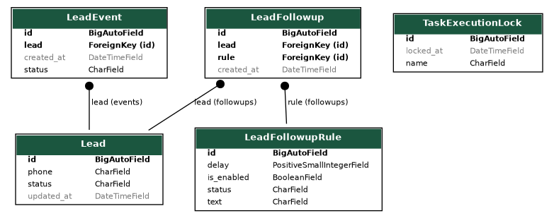

# drf_celery_example

An example project built with Django REST Framework and Celery.

## Contents

- [drf\_celery\_example](#drf_celery_example)
  - [Contents](#contents)
  - [1. Configuration Variables](#1-configuration-variables)
  - [2. Docker Compose Setup](#2-docker-compose-setup)
    - [2.1 Bootstrap Commands](#21-bootstrap-commands)
    - [2.2 Run Commands](#22-run-commands)
    - [2.3 Miscellaneous Commands](#23-miscellaneous-commands)
  - [3. Nix Flakes Setup](#3-nix-flakes-setup)
    - [3.1 Run Commands](#31-run-commands)
    - [3.2 Problem solving](#32-problem-solving)
  - [4. ER-diagram](#4-er-diagram)
  - [5. FAQ](#5-faq)
    - [5.1 Session data corrupted](#51-session-data-corrupted)
    - [5.2 Why does the daphne port differ in Docker and Nix Flakes?](#52-why-does-the-daphne-port-differ-in-docker-and-nix-flakes)

## 1. Configuration Variables

| Variable                               | Default                        | Description                                                                                                                               |
| -------------------------------------- | ------------------------------ | ----------------------------------------------------------------------------------------------------------------------------------------- |
| `LOG_LEVEL`                            | `"DEBUG"`                      | Logging threshold. Any value other than `DEBUG` disables Swagger UI and Django debug mode.                                                |
| `API_HOST`                             | `localhost; app`               | Semicolon-separated list of hostnames that Django should accept (for example: `d1.example.com; d2.example.com`).                          |
| `DJANGO_SECRET_KEY`                    | *Randomly generated*           | Django secret key. Set explicitly to keep sessions valid across restarts.                                                                 |
| `POSTGRES_HOST`                        | `"localhost"`                  | PostgreSQL host name.                                                                                                                     |
| `POSTGRES_PORT`                        | `5432`                         | PostgreSQL port.                                                                                                                          |
| `POSTGRES_USER`                        | `"app_user"`                   | Database user.                                                                                                                            |
| `POSTGRES_DB`                          | `"app_db"`                     | Database name.                                                                                                                            |
| `POSTGRES_PASSWORD`                    | `"pass"`                       | Password for `POSTGRES_USER`.                                                                                                             |
| `CELERY_BROKER_URL`                    | `redis://redis:6379/0`         | Broker connection string (Redis).                                                                                                         |
| `CACHE_URL`                            | `redis://redis:6379/2`         | Redis instance used for Django cache.                                                                                                     |
| `CELERY_RESULT_BACKEND`                | `redis://redis:6379/1`         | Redis instance used for storing Celery task results.                                                                                      |
| `CELERY_TASK_RESULT_EXPIRES`           | `3600`                         | Lifetime of Celery task results in seconds. Once expired, `AsyncResult` returns `None`.                                                   |
| `CELERY_BROKER_POOL_LIMIT`             | `10`                           | Maximum number of simultaneous broker connections kept in Celery’s connection pool.                                                       |
| `CELERY_BROKER_CONNECTION_TIMEOUT`     | `30`                           | Seconds to wait for a broker connection before failing.                                                                                   |
| `CELERY_BROKER_CONNECTION_MAX_RETRIES` | `0`                            | Number of reconnection attempts after a broker failure. `0` means retry forever; `None` lets Celery use its default setting.              |
| `CELERY_BEAT_SCHEDULE_FILENAME`        | `/data/celerybeat-schedule.db` | Path to the file where `celery beat` stores the schedule when running with `DatabaseScheduler`.                                           |
| `CELERY_BROKER_HEARTBEAT`              | `30`                           | Heartbeat interval (seconds) used to keep the broker connection alive and detect drops.                                                   |
| `FOLLOWUP_REPEAT_THRESHOLD`            | `1440`                         | Minutes to suppress a repeat follow-up notification after the previous one was sent.                                                      |
| `TASK_LOCK_TIMEOUT`                    | `60`                           | Expiration (seconds) for the database lock used by the `singleton_task` decorator; after this delay a stale lock is considered abandoned. |
| `NIX_DAPHNE_PORT`                      | `8081`                         | Port used for web communication with the Django project. Used when starting daphne, only in the Nix Flakes build.                          |

Configuration files for Docker and Nix builds - `env.list`.

If you want to run Django locally like `python manage.py runserver 0.0.0.0:8000`, you can use `local_env.list`:

```bash
set -a
source ./local_env.list
set +a
```

## 2. Docker Compose Setup

Docker Compose spins up the web app, Celery workers, PostgreSQL, and Redis in one network.
Install [Docker](https://docs.docker.com/engine/install) and [Docker Compose](https://docs.docker.com/compose/install) before continuing.

### 2.1 Bootstrap Commands

Start the database and Redis services:

```bash
docker compose up -d postgres redis
```

Run initial database migrations:

```bash
docker compose run --rm app python3 manage.py migrate
```

### 2.2 Run Commands

Launch the web app, Celery worker, and beat scheduler in the foreground:

```bash
docker compose up app worker beat
```

Run the same stack in the background:

```bash
docker compose up -d app worker beat
```

Rebuild containers after dependency updates:

```bash
docker compose up --build app worker beat
```

### 2.3 Miscellaneous Commands

Run the Django test suite for the `lead` app:

```bash
docker compose run --rm app python3 manage.py test lead
```

Create an admin user:

```bash
docker compose run --rm app python3 manage.py createsuperuser
```

## 3. Nix Flakes Setup

Nix provides an alternative stack that mirrors the Docker Compose.
Install [Nix](https://nixos.org/download) before continuing.
The flake expects the `nix-command` and `flakes` experimental features to be enabled.
Either set them globally (e.g. add `experimental-features = nix-command flakes` to `~/.config/nix/nix.conf`)
or pass `--extra-experimental-features 'nix-command flakes'` to each command shown below.

### 3.1 Run Commands

All flake outputs live in the `nix/` directory. Prefix the commands with
`./nix` (as in the examples) if you keep the repo layout unchanged.

Enter a development shell with Python, PostgreSQL, Redis, `uv`, and helper tools:

```bash
nix --extra-experimental-features 'nix-command flakes' develop ./nix
```

Launch the entire stack (web, worker, beat, PostgreSQL, Redis) in the foreground:

```bash
nix --extra-experimental-features 'nix-command flakes' run ./nix#stack
```

Or in Docker Compose Like mode:

```bash
nix --extra-experimental-features 'nix-command flakes' run ./nix#stack -- --tui=false
```

Logs are multiplexed by `process-compose`; press `q` to exit while leaving services
stopped cleanly.

Both commands reuse `env.list`. Host names such as `postgres` and `redis` are rewritten to `127.0.0.1` automatically for the Nix setup.

### 3.2 Problem solving

My Nix Flakes build script is far from ideal. If something goes wrong and I'm left with child processes:

```bash
./nix/scripts/kill-services.sh
```

## 4. ER-diagram



## 5. FAQ

### 5.1 Session data corrupted

If you see something like this in the logs:

```log
app-1     | 2025-09-20 21:00:36 | WARNING | django.security.SuspiciousSession (base) | Session data corrupted
```

Clear your browser's cookies for the domain where the application is running (or on localhost if you haven't changed anything).

To prevent this error, set DJANGO_SECRET_KEY. One way to generate it is:

```bash
echo "DJANGO_SECRET_KEY=\"$(openssl rand -base64 50 | tr -d '\n')\""
```

### 5.2 Why does the daphne port differ in Docker and Nix Flakes?

Nix Flakes uses [process-compose](https://github.com/F1bonacc1/process-compose), which by default occupies port 8080 with its Web service.
I chose 8081 as the default for daphne inside Nix. Not 80, because in WSL2, where I was developing, it requires root access.
